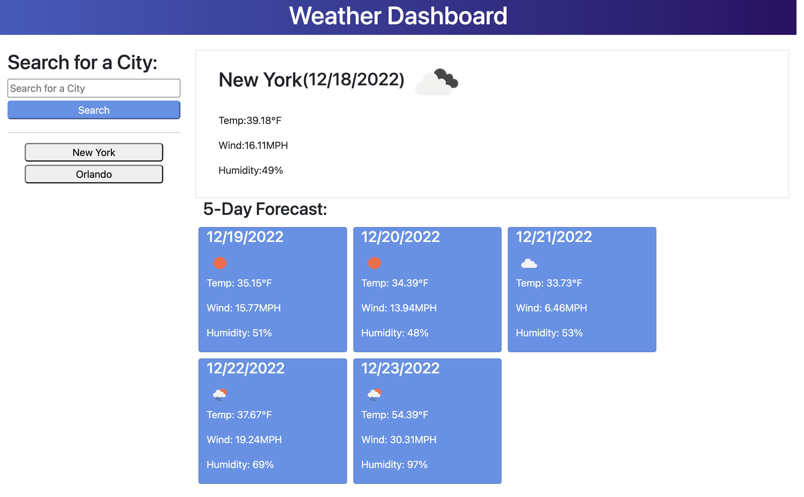

# Weather-App
An app that displays weather data.

## Description

This is a project that allows a user to look up the weather conditions in a specific city. User is able to enter a city and press a search button to get the current weather and five day future forecast for that city. The city is saved in local storage to be accessed at a later time period.

## Installation

Just need to download the source files from the github repository onto local. Open repository in VSCode and right click on index.html file and select "Open with Live Server". 

## Usage

This is a project that allows a user to look up the weather conditions in a specific city. User is able to enter a city and press a search button to get the current weather and five day future forecast for that city. The city is saved in local storage to be accessed at a later time period.

To view this application on Github Pages click [here](https://github.com/GarrettAnderson/weather-app).

Below are screenshots of the project:

## Credits

Used the following as a reference to help with the project:

* [Bind events to dynamically created HTML](https://webinuse.com/how-to-bind-events-to-dynamically-created-elements/)

## License

There is no license and this repo is available for reproduction.

